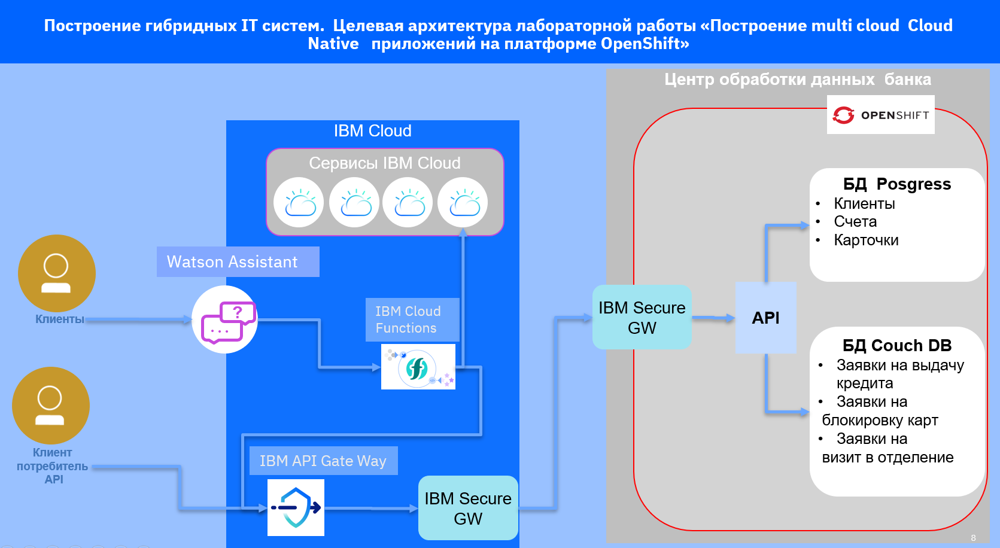
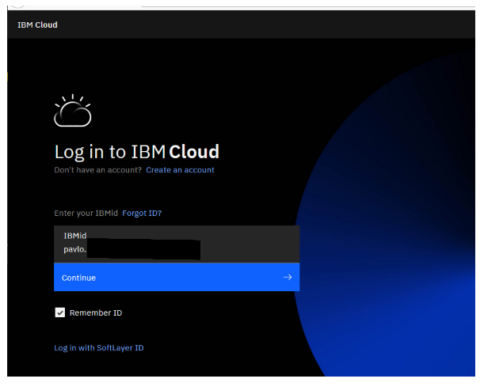
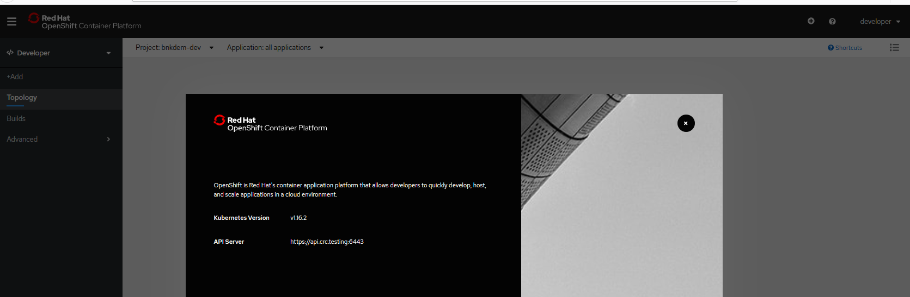

# bnkapi - Построение multicloud  CloudNative приложений на платформе OpenShift.

<!-- TOC BEGIN -->

- 1. [Цель работы](#p1)
- 2. [Инструменты, необходимые для выполнения работы](#p2)
- 3. [Назначение каталогов](#p3)
- 4. [Этапы выполнения](#p4)
- 4.1. [Создать проект Openshift и задеплоить его компоненты](#p4-1)
- 4.2. [Создать схему БД postgres](#p4-2)
- 4.3. [ Запустить приложение  банковского API  ./src/bnkdemo-be на локальной станции разработчика](#p4-3)
- 4.4. [ В IBM Cloud создать сервис IBM Secure Gateway  и настроить его взаимодействие с клиентской частью, задеплоенной в Openshift.](#p4-4)

<!-- TOC END -->

## Цель работы
Целью этой работы является построение модели банковского BackEnd  приложения  c использованием Cloud-Native технологий в локальном центре обработки данных на базе контейнерной платформы OpenShift.
Функциональность локального центра обработки данных будет расширена путем построения гибридной  облачной инфраструктуры и публикацией API в IBM-CLOUD.
Опубликованный API можно использовать другими программами-клиентами, например Watson Assistant в облаке IBM, или клиентами-сервисами других производителей.   

Целевая архитектура, которую получим в результате выполнения лабораторной работы, показана на рисунке pic-1 :

<kbd></kbd>

pic-1

В рамках этой работы познакомимся с такими компонентами:

- Контейнерная enterprise платформа **OpenShift**  построенная на базе kubernetes, развернутая в локальном центре обработки данных.
- Построение защищенного канала между локальным центром обработки данных и облаком IBM - **IBM Secure Gateway**  
- Публикация  и управление API в IBM Cloud с использованием **IBM Cloud API Gateway**;
- Использование опубликованного API на основе server less  продукта **IBM Cloud Functions**

## Инструменты, необходимые для выполнения работы

- Нужно иметь действующий account в [IBM Cloud](https://cloud.ibm.com/)
<kbd></kbd>

pic-2

- Установленную локально однопользовательскую платформу openshift для разработчиков [Red Hat CodeReady Containers](https://code-ready.github.io/crc) или многопользовательский  [OpenShift Container Platform 4.*](https://docs.openshift.com/container-platform/4.5/welcome/index.html)

<kbd></kbd>

pic-3

- Account на [github](https://github.com/)

- Account на [docker hub](https://hub.docker.com/)

- Установленную Node.js v10  для отладки и запуска приложений локально

- Установленный популярный редактор исходного кода [Visual Studio Code](https://code.visualstudio.com/docs#vscode) с плагинами для Node.js

- Установленный [клиент psql](https://www.postgresqltutorial.com/install-postgresql/) для работы с БД postgres

## Назначение каталогов

- ./openshift - содержит  набор скриптов [OpenShift CLI oc](https://docs.openshift.com/container-platform/4.5/cli_reference/openshift_cli/getting-started-cli.html)  для разворачивания проекта

- ./src - Исходный код

- ./src/bnkdemo-be - исходный код банковского API на Node.js
- ./src/ddl-bnk  - DDL скрипты для создания схемы данных в БД postgres
- ./API - формализованное описание Rest-API в виде swagger.json

## Этапы выполнения

### Создать проект Openshift и развернуть его компоненты

 Инструкция по развертыванию с пояснениями находится в файле: [openshift/readme.md](openshift/readme.md)

 
 ### Создать схему БД postgres

Инструкция по запуску на выполнение DDL-скриптов находится в файле [src/ddl-bnk/readme.md](src/ddl-bnk/readme.md)  

 
 ### Запустить приложение  банковского API  ./src/bnkdemo-be на локальной станции разработчика

 Инструкция по запуску локально и выполнения тестовых кейсов в файле [./src/bnkdemo-be/readme.md](./src/bnkdemo-be/readme.md)

 
 ### В IBM Cloud создать сервис IBM Secure Gateway  и настроить его взаимодействие с клиентской частью, развернутой в Openshift.
