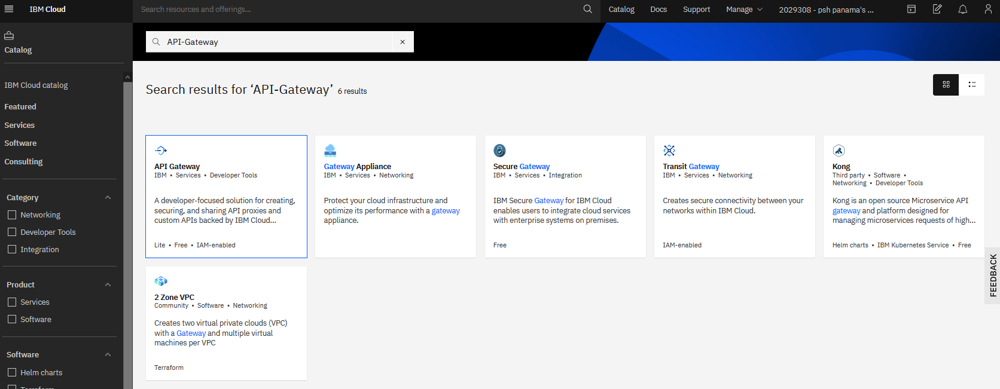
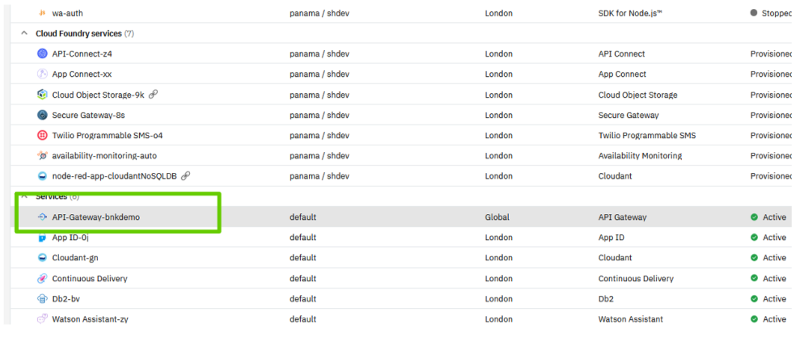
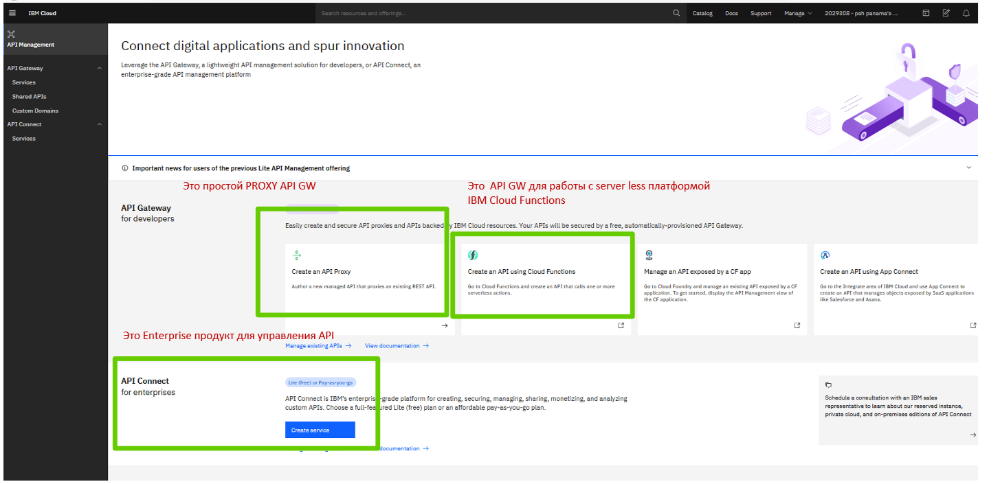
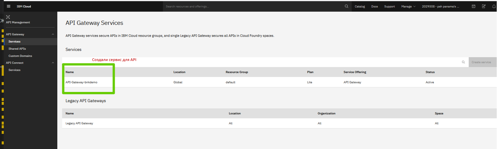
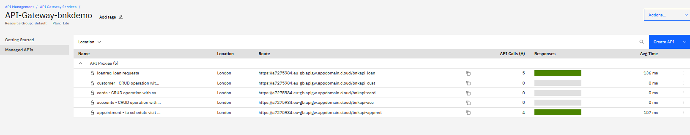
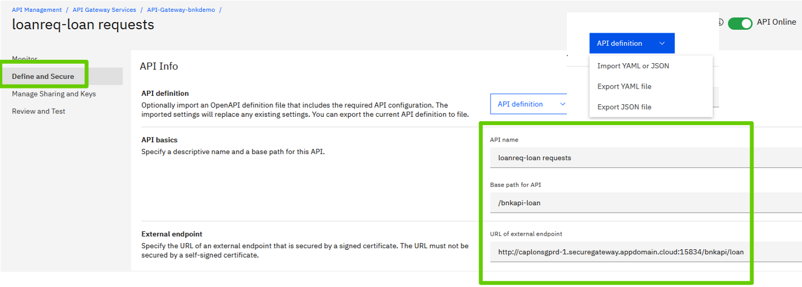
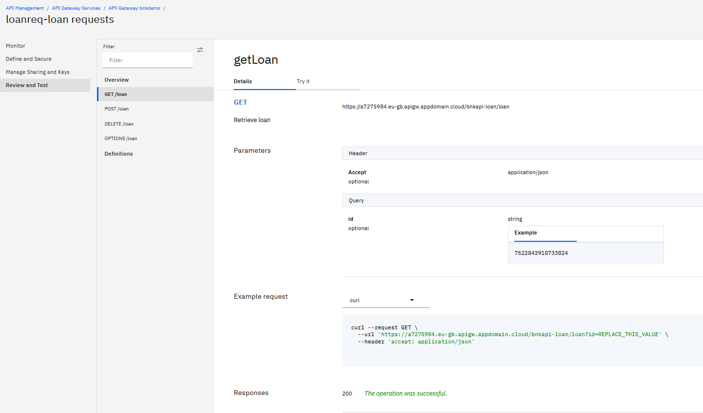

# bnkapi - Построение multicloud  CloudNative приложений на платформе OpenShift. Интеграция с IBM Cloud. API-GateWay

<!-- TOC BEGIN -->
- 1. [API Gateway - для чего он нужен](#p1)
- 2. [Шаги по развертыванию API ](#p2)
- 3. [tbd](#p3)

<!-- TOC END -->

## API Gateway - для чего он нужен

IBM® Cloud API Gateway - это бесплатная служба, которую вы можете использовать для создания, защиты, совместного использования и управления API-интерфейсами, которые обращаются к ресурсам IBM Cloud.

API Gateway работает, вставляя быстрый и легкий шлюз перед существующими end-points IBM Cloud. Шлюз перехватывает входящий вызов API и выполняет политики безопасности, а затем направляет вызов во внутреннее приложение. После обработки запроса фоновое приложение отправляет ответ шлюзу, который затем направляет его обратно вызывающей стороне.

## Шаги по развертыванию Secure Gateway

Для развертываня необходимо выполнитьтакие ряд шагов.

- В каталоге IBM Cloud в разделе сервисы-интеграция найти продукт: pic-1
 <kbd></kbd>

pic-1

- Выполнить инсталляцию сервиса в своем облачном account: pic-2.

 <kbd></kbd>

pic-2

В реальности API-GateWay объединяет в себе несколько продуктов. На pic-3 кратко отмечены самые интересные.

 <kbd></kbd>

pic-3

- Создадим API Proxy
 <kbd></kbd>

pic-4

На pic-5 показано уже создано 5 API.

 <kbd></kbd>

pic-5

- Получить GateWay ID и Security Token и внести их в настройки клиента: pic-6
 <kbd></kbd>

pic-6

Сразу же после создания API  его можно протестировать: pic-7. А потом установить желаемые настройки безопасности.
 <kbd></kbd>

pic-7

